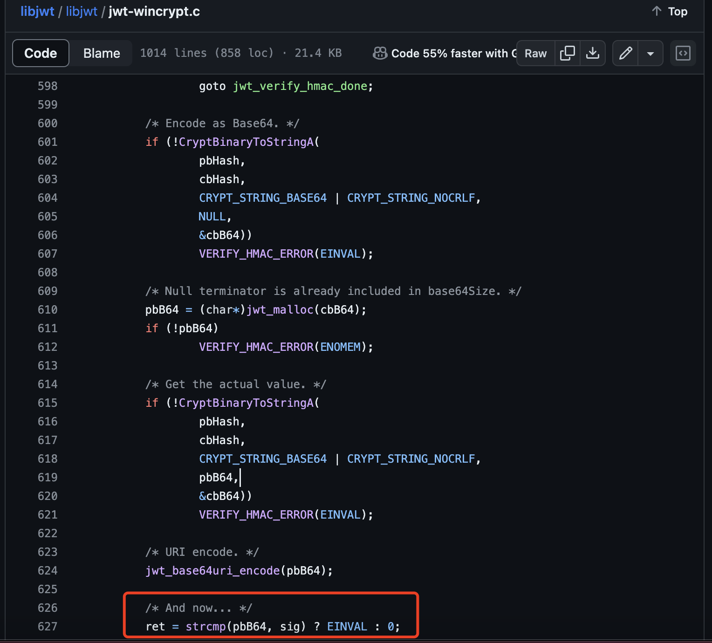

# benmcollins/libjwt exists insecure signature verification

## 0x01 Affected version

vendor: https://github.com/benmcollins/libjwt

version: 1.15.3

## 0x02 Vulnerability description

The `jwt_verify_sha_hmac` function of `jwt-wincrypt.c` implements the function of comparing the HS256 algorithm signature.

However, the function uses `strcmp` to compare the calculated signature with the JWT signature we provided, and strcmp is not a time-safe comparison function.

This means that the more similar the prefix of the signature we provide to the actual calculated signature, the longer the comparison will take, which can lead to temporal side-channel attacks